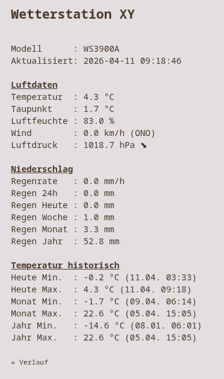
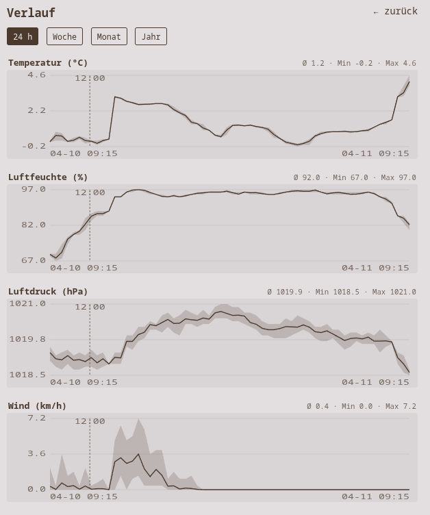
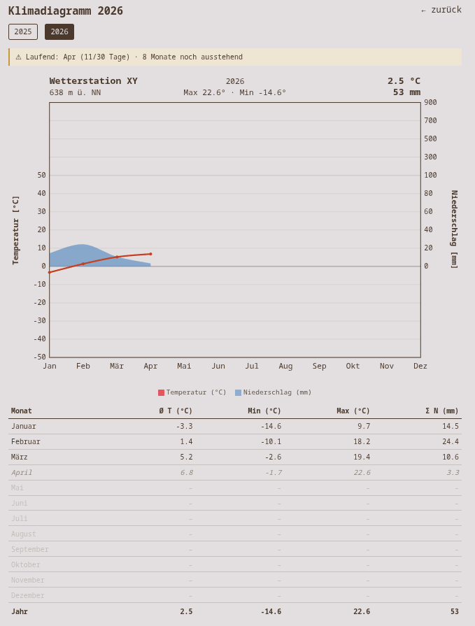

# ecowitt-wetter

Empfangsserver und Weboberfläche für Wetterstationen mit dem Ecowitt-Custom-Upload-Protokoll.
Die Station schickt ihre Messwerte per HTTP-POST an die App. Gespeichert wird in SQLite,
angezeigt auf einer bewusst minimalistischen Webseite mit Verlaufsdiagrammen, Klimadiagramm
und JSON-API.

**Version 2** ist eine Neuimplementierung in **TypeScript/SvelteKit** mit Docker-Deployment
(z. B. auf [Coolify](https://coolify.io)). Datenbank-Schema und API sind kompatibel zur
Python-Version, eine bestehende `wetterdaten.db` kann direkt übernommen werden.

## Features

- **Echtzeit-Anzeige** auf einer einzigen, minimalen Seite (Temperatur, Taupunkt,
  Luftfeuchte, Wind mit Böen, Luftdruck inkl. 3-h-Trendpfeil, Regenwerte), Auto-Refresh
  alle 60 s ohne Neuladen der Seite
- **Tages-, Monats- und Jahres-Min/Max** der Temperatur mit Zeitpunkt
- **Verlaufsdiagramme** unter `/history` (24 h, Woche, Monat, Jahr) als reines SVG, ohne
  Chart-Bibliothek
- **Klimadiagramm** pro Jahr unter `/klima` im Walter-Lieth-Stil mit Monatstabelle und
  Hinweisen bei unvollständigen Jahren
- **JSON-API** (`/api/latest`, `/api/history`, `/api/climate`) für Home Assistant, Grafana,
  Node-RED usw.
- **Einheiten** werden automatisch umgerechnet (°F → °C, inHg → hPa, mph → km/h, in → mm)
- **Sensor-Dropout-Filter**: Der Offline-Sentinel der Station (`humidity=0`) wird verworfen
- **Regen 24 h** wird aus der 24-h-Differenz von `rainyear` berechnet (übersteht Neustarts
  der Station)
- **Stale-Indikator** (> 10 min) und **Batteriewarnung** für Außensensor und Konsole
- **Absicherung**: optionaler PASSKEY, optionaler getrennter Ingest-Hostname, konfigurierbares
  CORS
- **Als PWA installierbar** (Manifest, Service Worker mit Offline-Fallback)
- **Status-Seite** `/status` mit der Ausfallhistorie (nicht verlinkt)

## Screenshots

| Hauptseite                              | Verlauf                            | Klimadiagramm                                   |
| --------------------------------------- | ---------------------------------- | ----------------------------------------------- |
|  |  |  |

## Technik

| Bereich    | Stack                                                                |
| ---------- | -------------------------------------------------------------------- |
| Runtime    | Node.js 22 LTS                                                       |
| App        | SvelteKit 2 + Svelte 5 (Runes), `@sveltejs/adapter-node`, TypeScript |
| Datenbank  | SQLite (WAL) über `better-sqlite3` + Drizzle ORM                     |
| Config     | Umgebungsvariablen, validiert mit zod                                |
| Qualität   | Vitest, svelte-check, ESLint, Prettier, GitHub Actions               |
| Deployment | Docker (multi-stage, non-root) + `docker-compose.yml` für Coolify    |

```
src/
  hooks.server.ts          Ingest-Host-Sperre, CORS, Start-Initialisierung
  service-worker.ts        PWA, network-first
  lib/server/              Fachlogik (Ingest, Umrechnung, Min/Max, Verlauf, Klima, Ausfälle)
  lib/components/          LineChart, ClimateChart, RangeNav
  routes/                  Seiten (/, /history, /klima, /status) und Endpunkte
scripts/migrate-legacy.ts  Migration sehr alter Datenbanken (siehe unten)
```

## Konfiguration

Alle Einstellungen kommen aus Umgebungsvariablen (Vorlage: `.env.example`).

| Variable              | Default                         | Bedeutung                                                                              |
| --------------------- | ------------------------------- | -------------------------------------------------------------------------------------- |
| `STATION_NAME`        | `Wetterstation`                 | Seitentitel, Überschrift, PWA-Name                                                     |
| `STATION_ELEVATION_M` | `0`                             | Seehöhe (Kopfzeile des Klimadiagramms)                                                 |
| `ECOWITT_PASSKEY`     | leer                            | PASSKEY der Station. Ist er gesetzt, werden Uploads mit anderem Wert mit 401 abgelehnt |
| `CORS_ORIGINS`        | `*`                             | Erlaubte Origins für `/api/*`, kommagetrennt. Leer = CORS aus                          |
| `INGEST_HOST`         | leer                            | Getrennter Hostname für die Station, dort ist nur `POST /ecowitt` erreichbar           |
| `TZ`                  | `Europe/Vienna`                 | Zeitzone für Zeitstempel und Tages-/Monats-/Jahresgrenzen                              |
| `DATABASE_PATH`       | `/data/wetterdaten.db` (Docker) | Pfad der SQLite-Datei                                                                  |
| `PORT`                | `3000`                          | HTTP-Port im Container                                                                 |

> **Wichtig:** `TZ` muss der Zeitzone entsprechen, in der die bestehenden Daten geschrieben
> wurden. Zeitstempel werden als lokale Zeit gespeichert, genau wie in der Python-Version.

## Deployment auf Coolify

### 1. Ressource anlegen

1. In Coolify: **Projects → + New → Public/Private Repository** und dieses Repository wählen.
2. **Build Pack: Docker Compose**, Compose-Datei `docker-compose.yml`.
3. Unter **Environment Variables** mindestens `STATION_NAME`, `STATION_ELEVATION_M`,
   `ECOWITT_PASSKEY` und `TZ` setzen. Coolify zeigt alle `${…}`-Variablen aus der
   Compose-Datei automatisch an.
4. Das benannte Volume `wetter-data` (→ `/data`) legt Coolify automatisch als persistenten
   Speicher an. Unter **Backups** bzw. **Storages** lässt es sich sichern.

### 2. Domains

Ecowitt-Konsolen können im Custom-Upload **kein HTTPS**. Deshalb bekommt der Service zwei
Domains (Feld **Domains** des Service `app`, kommagetrennt, jeweils mit Container-Port):

```
https://wetter.example.com:3000,http://wetter-ingest.example.com:3000
```

- `https://wetter.example.com` für den Browser (TLS über Let's Encrypt)
- `http://wetter-ingest.example.com` nur für die Station. Dafür darf keine
  HTTPS-Weiterleitung aktiv sein, die Station folgt keinen Redirects.

Dann `INGEST_HOST=wetter-ingest.example.com` setzen. Über diesen Host beantwortet die App
ausschließlich `POST /ecowitt`, alle anderen Pfade (Seiten, API, `/ecowitt/passkey`) liefern
`404`. Der Vergleich nutzt `X-Forwarded-Host` bzw. `Host`, die Traefik korrekt weiterreicht.

**Absicherung des Ingest-Hosts** (empfohlen):

- `ECOWITT_PASSKEY` setzen (siehe unten)
- Wenn möglich per Firewall bzw. Traefik-IP-Allowlist nur die WAN-IP der Station zulassen
- Rate-Limit am Proxy: ein POST alle 15 s reicht

Wird die App nur im Heimnetz betrieben, genügt eine Domain. Die Station sendet dann direkt
an die LAN-IP des Coolify-Servers.

### 3. Bestehende Datenbank übernehmen

1. Auf dem alten Host den Dienst stoppen (`systemctl stop ecowitt-wetter`), damit alle
   Schreibvorgänge abgeschlossen sind.
2. Datei auf den Coolify-Server kopieren:
   `scp /opt/ecowitt-wetter/db/wetterdaten.db root@coolify-server:/root/`
3. In Coolify die Ressource einmal deployen (legt das Volume an) und dann **stoppen**.
4. Auf dem Server das Volume suchen und die Datei hineinkopieren:

   ```bash
   docker volume ls | grep wetter-data          # Name z. B. abc123_wetter-data
   docker run --rm -v abc123_wetter-data:/data -v /root:/src node:22-bookworm-slim \
     sh -c 'cp /src/wetterdaten.db /data/wetterdaten.db && chown 1000:1000 /data/wetterdaten.db'
   ```

5. Ressource in Coolify wieder starten. Fehlende neuere Spalten ergänzt die App beim Start
   automatisch, vorhandene Daten bleiben unverändert.

### 4. Station konfigurieren

In der WSView- oder Ecowitt-App unter **Customized / Custom Server**:

- **Protokoll**: Ecowitt
- **Server/IP**: `wetter-ingest.example.com` (bzw. LAN-IP)
- **Port**: `80` (bzw. `3000` bei direktem Zugriff ohne Proxy)
- **Pfad**: `/ecowitt`
- **Upload-Intervall**: 15 s oder mehr

### PASSKEY ohne WSView-App auslesen

1. Zunächst ohne `ECOWITT_PASSKEY` deployen und die Station senden lassen.
2. Beim ersten Upload schreibt die App den empfangenen PASSKEY einmalig ins Log
   (Coolify → **Logs**).
3. Alternativ im Container abrufen (Coolify → **Terminal** oder `docker exec`):

   ```bash
   node -e "fetch('http://127.0.0.1:3000/ecowitt/passkey').then(r=>r.text()).then(console.log)"
   ```

   Der Endpoint antwortet nur auf direkte Loopback-Anfragen ohne Proxy-Header und nur,
   solange kein `ECOWITT_PASSKEY` gesetzt ist.

4. Den Wert als `ECOWITT_PASSKEY` eintragen und neu deployen.

## Lokale Entwicklung

Voraussetzungen: Node.js ≥ 22 und pnpm (`corepack enable`).

```bash
pnpm install
cp .env.example .env        # optional, Werte anpassen
pnpm dev                    # http://localhost:5173 (DB unter ./data/wetterdaten.db)

pnpm test                   # Vitest
pnpm check                  # svelte-check / TypeScript
pnpm lint                   # Prettier + ESLint
pnpm build && pnpm start    # Produktions-Build, Port 3000
```

Testdaten einspeisen:

```bash
curl -X POST localhost:5173/ecowitt \
  -d 'PASSKEY=test&model=WS2900&tempf=68&humidity=55&baromrelin=30.0&windspeedmph=3&winddir=180&yearlyrainin=10'
```

Mit Docker, ohne Coolify:

```bash
docker compose -f docker-compose.yml -f docker-compose.local.yml up -d --build
```

## Endpoints

| Route                                          | Methode | Zweck                                                       |
| ---------------------------------------------- | ------- | ----------------------------------------------------------- |
| `/`                                            | GET     | Hauptseite                                                  |
| `/history?range=24h\|7d\|30d\|365d`            | GET     | Verlaufsdiagramme                                           |
| `/klima?year=YYYY`                             | GET     | Klimadiagramm eines Kalenderjahres                          |
| `/status?range=7d\|30d\|90d\|365d`             | GET     | Ausfallhistorie (nicht verlinkt)                            |
| `/ecowitt`                                     | POST    | Empfänger für Station-Uploads                               |
| `/ecowitt/passkey`                             | GET     | Setup-Hilfe (nur Loopback, nur ohne konfigurierten PASSKEY) |
| `/api/latest`                                  | GET     | Aktueller Messwert-Satz                                     |
| `/api/history`                                 | GET     | Aggregierter Verlauf einer Messgröße                        |
| `/api/climate?year=YYYY`                       | GET     | Monatliche Klima-Aggregation                                |
| `/healthz`                                     | GET     | Health-Check (Docker/Coolify)                               |
| `/manifest.webmanifest` · `/service-worker.js` | GET     | PWA                                                         |

### `/api/history`

- `metric` (Pflicht): `temperature`, `humidity`, `pressure`, `pressureabs`, `windspeed`,
  `windgust`, `maxdailygust`, `winddir`, `solar`, `uv`, `indoortemp`, `indoorhumidity`,
  `vpd`, `rainrate`, `raintoday`, `rainweek`, `rainmonth`, `rainyear`
- `from`: Start, lokale Zeit (`2026-04-01 00:00:00`). Ohne Angabe wird je nach Bucket begrenzt:
  `1m`→1 Tag, `5m`→7 Tage, `15m`→31 Tage, `1h`→180 Tage, `1d`→5 Jahre
- `to`: Ende (exklusiv)
- `bucket`: `1m`, `5m`, `15m`, `1h` (Default) oder `1d`

Rückgabe: `{ metric, bucket, from, to, count, points: [{ t, avg, min, max }] }` mit maximal
5000 Punkten.

```bash
curl 'https://wetter.example.com/api/history?metric=temperature&bucket=1d&from=2026-04-01'
```

### `/api/climate`

Pro Monat: Durchschnitts-, Minimal- und Maximaltemperatur, Niederschlagssumme
(`MAX(rainmonth)`) und Status `complete`, `incomplete` (< 90 % der Tage mit Daten),
`partial` (laufender Monat), `missing` oder `future`.

## Datenbank-Schema

```sql
CREATE TABLE wetterdaten (
    id             INTEGER PRIMARY KEY AUTOINCREMENT,
    timestamp      DATETIME NOT NULL,  -- Lokalzeit "YYYY-MM-DD HH:MM:SS"
    model          TEXT,
    temperature    REAL,   -- °C
    humidity       REAL,   -- %
    pressure       REAL,   -- hPa, auf NN reduziert
    pressureabs    REAL,   -- hPa, absolut
    windspeed      REAL,   -- km/h
    windgust       REAL,   -- km/h
    maxdailygust   REAL,   -- km/h
    winddir        REAL,   -- Grad
    solar          REAL,   -- W/m²
    uv             REAL,
    indoortemp     REAL,   -- °C
    indoorhumidity REAL,   -- %
    vpd            REAL,   -- kPa
    rainrate       REAL,   -- mm/h
    rainlast24hrs  REAL,   -- mm
    raintoday      REAL,   -- mm
    rainweek       REAL,   -- mm
    rainmonth      REAL,   -- mm
    rainyear       REAL,   -- mm
    batt_sensor    INTEGER, -- 0 = ok, 1 = schwach (wh65batt)
    batt_console   REAL     -- Spannung Konsole in V
);
CREATE INDEX idx_wetterdaten_timestamp ON wetterdaten(timestamp);
```

### Migration aus sehr alten Versionen

Datenbanken aus Versionen vor dem obigen Schema (TEXT-Spalten, Kompassrichtung als Text,
Spalten `time`/`shorttime`) einmalig migrieren. Vorher ein Backup anlegen:

```bash
node --experimental-strip-types scripts/migrate-legacy.ts wetterdaten.db 638   # Seehöhe in m
```

Das Skript entspricht dem früheren `migrate.py`: Es rechnet Wind von mph in km/h um,
wandelt Kompasstexte in Grad, reduziert den Druck auf Seehöhe, legt den Index an und führt
`VACUUM` aus. Datenbanken, die bereits das obige Schema haben (von der Python-Version neu
angelegt oder schon mit `migrate.py` migriert), brauchen das nicht.

## Übertragene Station-Felder

| Station-Feld     | DB-Spalte        | Umrechnung                                       |
| ---------------- | ---------------- | ------------------------------------------------ |
| `tempf`          | `temperature`    | °F → °C                                          |
| `humidity`       | `humidity`       | –                                                |
| `baromrelin`     | `pressure`       | inHg → hPa                                       |
| `baromabsin`     | `pressureabs`    | inHg → hPa                                       |
| `windspeedmph`   | `windspeed`      | mph → km/h                                       |
| `windgustmph`    | `windgust`       | mph → km/h                                       |
| `maxdailygust`   | `maxdailygust`   | mph → km/h                                       |
| `winddir`        | `winddir`        | Grad                                             |
| `solarradiation` | `solar`          | W/m²                                             |
| `uv`             | `uv`             | Index                                            |
| `tempinf`        | `indoortemp`     | °F → °C                                          |
| `humidityin`     | `indoorhumidity` | –                                                |
| `vpd`            | `vpd`            | kPa                                              |
| `rainratein`     | `rainrate`       | in/h → mm/h                                      |
| `last24hrainin`  | `rainlast24hrs`  | in → mm (Anzeige nutzt die `rainyear`-Differenz) |
| `dailyrainin`    | `raintoday`      | in → mm                                          |
| `weeklyrainin`   | `rainweek`       | in → mm                                          |
| `monthlyrainin`  | `rainmonth`      | in → mm                                          |
| `yearlyrainin`   | `rainyear`       | in → mm                                          |
| `wh65batt`       | `batt_sensor`    | 0 = ok, 1 = schwach                              |
| `console_batt`   | `batt_console`   | V                                                |

## Lizenz

MIT, siehe [LICENSE](LICENSE).
